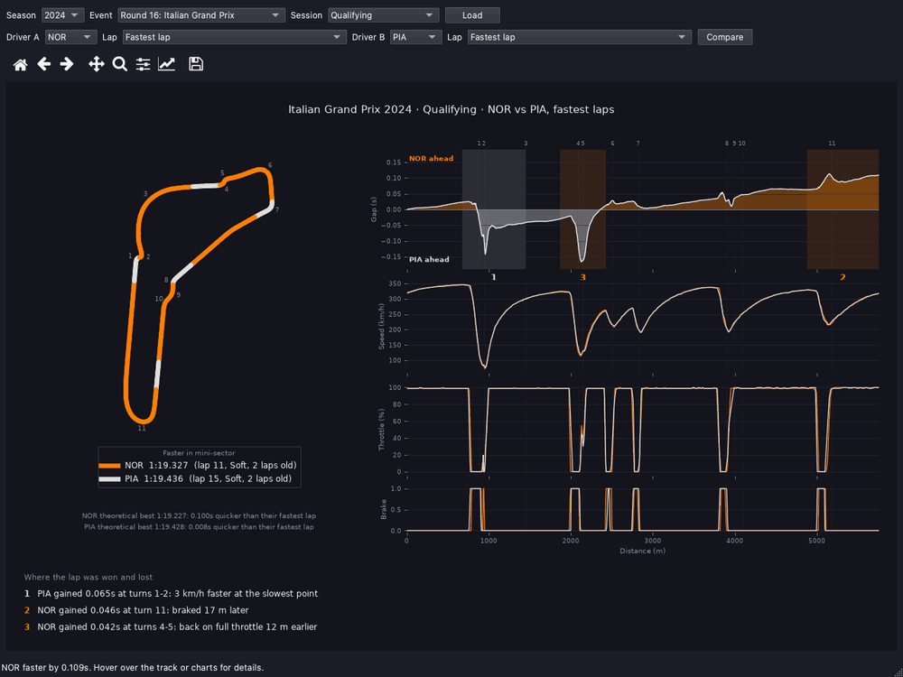
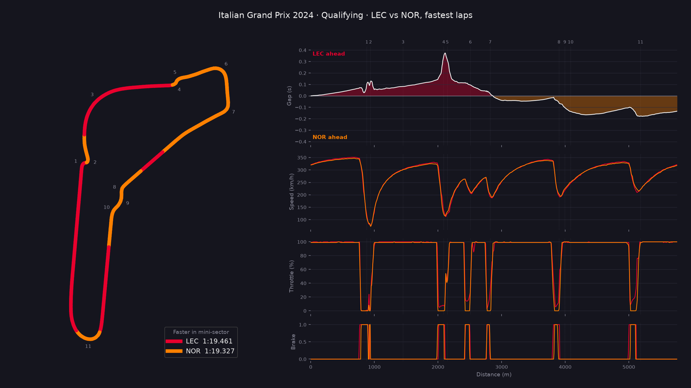
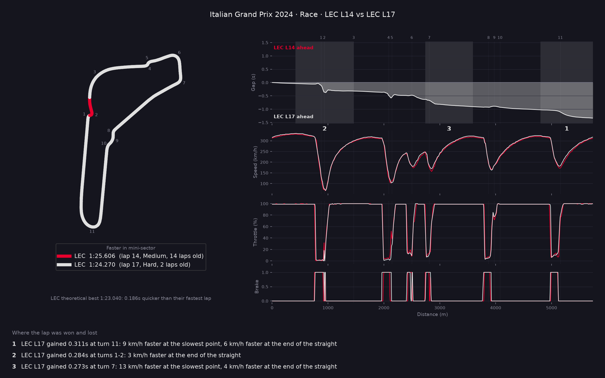

# F1 Deltaline

[](https://github.com/ervinjohn50/f1-deltaline/actions/workflows/tests.yml)

See exactly where on track one driver was faster than another.

F1 Deltaline loads two laps (each driver's fastest by default, or any laps you
choose) and shows the comparison in a desktop app or as an image from the
command line:

- **Track map** coloured by who was quicker in each mini-sector, with corner numbers
- **Gap chart**: the running time gap around the lap, so you can see where each
  driver gained and lost time
- **Speed, throttle and brake** for both drivers, lined up by distance
- **Theoretical best lap**: each driver's best sector 1, 2 and 3 from the whole
  session added up, and how much quicker that is than their fastest lap
- **Where the lap was won and lost**: the three corners where the gap changed
  most, in plain English, numbered on the gap chart



## Setup

Requires [uv](https://docs.astral.sh/uv/).

```bash
uv sync
```

## Desktop app

```bash
uv run app.py
```

Pick a season, event and session and press **Load**. The top two drivers'
fastest laps are compared straight away; choose any two drivers and laps and
press **Compare** to change it. Hover over the track map or charts to see both
drivers' speed, throttle and the gap at that point. The toolbar zooms, pans
and saves the figure.

The first load of a session downloads its data, which can take a minute; the
window stays usable while it loads, and later loads come from the cache.

To quit, close the window (or press Ctrl+C in the terminal). If a download is
still running, the app finishes it first so the data cache isn't left half
written, and says so in the terminal; Ctrl+C quits straight away.

If F1's data for a session has gaps that affect the comparison, such as no
position data (so no track map), an amber **data note** appears in the status
bar; hover over it to read all of them. The command line prints the same
notes under "Data notes".

## Command line

Compare two drivers' fastest laps:

```bash
uv run main.py --year 2024 --event Monza --session Q --drivers LEC NOR
```

It prints a summary and saves the figure as an image:



```
Where the lap was won and lost:
  NOR gained 0.068s at turn 6: 3 km/h faster at the slowest point
  NOR gained 0.066s at turn 7: back on full throttle 17 m earlier
  LEC gained 0.058s at the run to turns 1-2: 4 km/h faster at the end of the straight
```

List each driver's laps (lap time, tyre, in/out-laps, fastest, deleted), then
compare specific ones:

```bash
uv run main.py --year 2024 --event Monza --session R --drivers LEC PIA --list-laps
uv run main.py --year 2024 --event Monza --session R --drivers LEC PIA --laps 40 40
```

Compare two laps by the same driver, e.g. worn mediums against new hards:

```bash
uv run main.py --year 2024 --event Monza --session R --drivers LEC --laps 14 17
```



| Option | Description |
|---|---|
| `--year` | Season, e.g. `2024` (telemetry is available from 2018) |
| `--event` | Event name or round number, e.g. `Monza` or `16` |
| `--session` | `R`, `Q`, `S`, `FP1`, `FP2`, `FP3` (default `Q`) |
| `--drivers` | Two driver abbreviations, e.g. `VER HAM`, or one with `--laps` to compare two of their laps |
| `--laps` | Lap number for each driver, or `fastest`, e.g. `--laps 12 fastest` (default: both fastest) |
| `--list-laps` | List both drivers' laps and exit |
| `--sectors` | Number of mini-sectors (default `25`) |
| `--no-show` | Save the image without opening a window |

In-laps and out-laps can be compared, but part of them is in the pit lane, so
F1 Deltaline prints a warning. Laps without a lap time (usually out-laps in
qualifying) can't be compared.

The theoretical best leaves out laps deleted for track limits. It's most
meaningful in qualifying and practice; in a race the best sectors can come from
very different fuel loads and tyres, so F1 Deltaline flags it as rough.

Images are saved to `output/`. Session data is cached in `.fastf1-cache/`, so
the first load of a session is slow and later loads are fast.

## How it works

1. **Load** the session with [FastF1](https://github.com/theOehrly/Fast-F1) and
   take the chosen lap for each driver (fastest by default).
2. **Normalise** each lap's distance to 0–1, so laps of slightly different
   measured length line up.
3. **Split** the lap into equal mini-sectors and interpolate the time each
   driver reached every boundary. The difference is the time spent in that sector.
4. **Colour** the track by the driver with the lower time in each sector.
5. **Gap and traces**: resample both laps onto a shared grid of 1,000 points
   along the lap. The gap at each point is B's elapsed time minus A's, so where
   the line rises A is gaining and where it falls B is.
6. **Where the lap was won and lost**: split the lap into zones, one per corner
   (corners less than 200 m apart, like a chicane, count as one). Each zone runs
   from the fastest point before its corner to the fastest point before the
   next, so it covers braking, the corner, the exit and the following straight.
   The gap change across each zone is measured, and for the three biggest the
   faster driver's braking point, slowest speed, full-throttle point and top
   speed are compared with the other driver's.

### Why zone edges are at the fastest points

A small distance error costs little time at high speed and a lot at low speed,
so the gap is most reliable at the end of a straight. Putting zone edges there
means the gap change across a zone isn't thrown off by the short spikes the gap
chart can show inside slow corners. Corners with no real straight between them
(the fastest point between them is under 70% of the lap's top speed) are merged
into one zone for the same reason. The zone gains always add up to the final
lap time gap.

Differences are only mentioned when they're big enough to trust given the data:
at least 0.02s gained, 10 m for braking and throttle points (car data arrives
about every 20 m at top speed), and 3 km/h for speeds. If none apply, the
summary says there's no single clear cause.

### Lap distance

Lap distance is calculated from speed and time using the trapezoid rule (the
average of each pair of speed readings). FastF1's built-in `Distance` instead
multiplies each reading by the time since the previous one, which comes up
several metres short under braking and long under acceleration. Because the
two drivers' readings fall at different moments, those errors differ and show
up as false spikes in the gap chart at slow corners. Switching to the trapezoid
rule cut the worst spike at Monza 2024 (LEC vs NOR) from 0.18s to 0.135s.

### Known limitations

Some short spikes remain in slow corners (e.g. Monza turns 4–5). Car data
arrives about four times a second, so at 300 km/h a car travels ~20 m between
readings. Part of what's left may be real (different braking points and
minimum speeds) and part is this sampling limit; the data can't fully tell them
apart. The overall trend and the gap at the finish line are accurate.

Some sessions have gaps in F1's position data (where each car is on track).
In the 2026 Monaco race, for example, it stops partway through, so most
drivers' fastest laps have none. Those laps are compared using car data alone,
which gives the same results (checked on a full lap: same distance, same gap),
but the track map shows "unavailable". Corner positions also need position
data, so for those sessions they're taken from another session of the same
event, usually qualifying, which may mean one extra download.

## Tests

```bash
uv run pytest
```

The tests don't download any race data: the analysis is tested on made-up laps
with known answers, and the desktop app (with [pytest-qt](https://pytest-qt.readthedocs.io/))
is given fake loaders and runs without a screen.

## Engineering notes

[docs/engineering-notes.md](docs/engineering-notes.md) covers the problems found
while building F1 Deltaline and how they were fixed and checked, from the false
spikes in FastF1's distance data to sessions where F1's position data stops
partway through.

## Credits

Inspired by [f1-race-replay](https://github.com/IAmTomShaw/f1-race-replay).
Data via [FastF1](https://github.com/theOehrly/Fast-F1).

F1 Deltaline is an unofficial fan project and is not affiliated with Formula 1
or the FIA.
